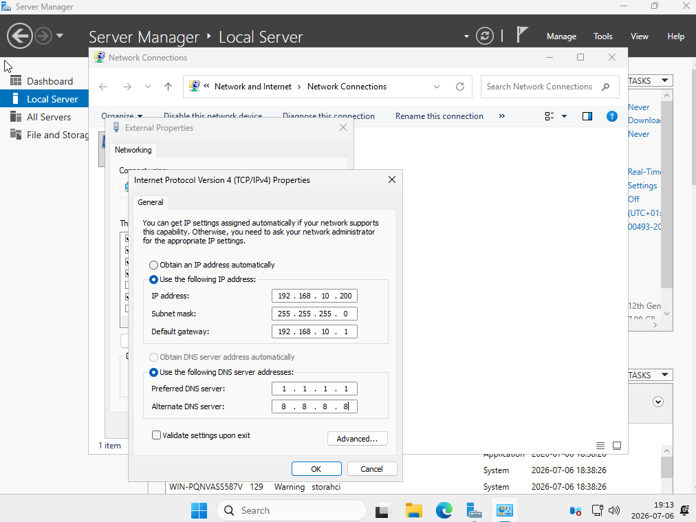
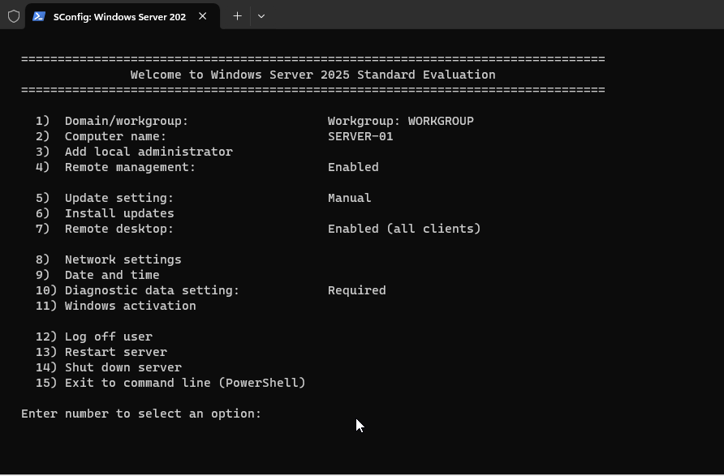

# Lab 02 - Initial Server Configuration

## Overview

This lab focuses on the initial configuration of a newly installed Windows Server 2025 virtual machine. The server was prepared for future infrastructure services by configuring basic network settings, reviewing server options, and verifying system configuration.

---

## Lab Environment

| Component | Configuration |
|-----------|---------------|
| Hypervisor | Oracle VirtualBox |
| Host Operating System | Windows 10 |
| Guest Operating System | Windows Server 2025 Standard Evaluation |
| Virtual Machine | SERVER-01 |
| Network Adapter | Bridged Adapter |

---

## Objectives

- Configure the server after installation
- Assign a static IPv4 address
- Configure DNS client settings
- Review Windows Server SConfig
- Verify basic server configuration
- Prepare the server for Active Directory deployment

---

## Tasks Completed

- Configured a static IPv4 address
- Configured the subnet mask and default gateway
- Assigned temporary public DNS servers
- Reviewed SConfig settings
- Verified the server name
- Verified remote management settings
- Verified Remote Desktop configuration
- Prepared the server for Active Directory Domain Services (AD DS)

---

## Network Configuration

| Setting | Value |
|---------|-------|
| IP Address | 192.168.10.200 |
| Subnet Mask | 255.255.255.0 |
| Default Gateway | 192.168.10.1 |
| Preferred DNS | 1.1.1.1 |
| Alternate DNS | 8.8.8.8 |

> **Note:** Public DNS servers were used only during the initial setup. After installing the DNS Server role, the Preferred DNS server was changed to the local DNS server.

---

## Screenshots

### Static IPv4 Configuration

### Windows Server SConfig

---

## Skills Practiced

- Windows Server Administration
- Static IPv4 Configuration
- DNS Client Configuration
- TCP/IP Networking
- Windows SConfig
- Basic Server Configuration

---

## Technologies Used

- Windows Server 2025
- Oracle VirtualBox
- IPv4
- TCP/IP
- SConfig

---

## Outcome

The Windows Server 2025 virtual machine was successfully configured with a static IP address and basic networking settings. The server is now ready for the installation of Active Directory Domain Services (AD DS), DNS Server, and other infrastructure roles.

---

## Next Lab

**Lab 03 – Active Directory Domain Services (AD DS) Installation**
