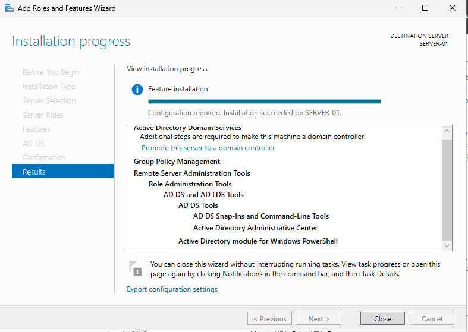
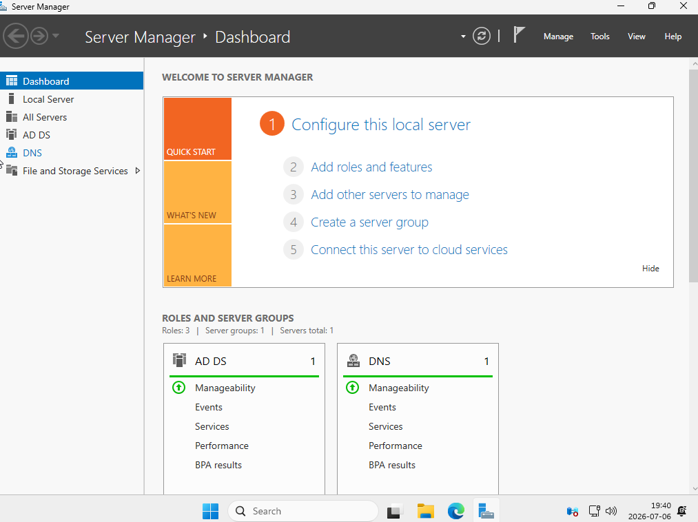

# Lab 03 - Active Directory Domain Services (AD DS)

## Overview

This lab demonstrates the installation and configuration of Active Directory Domain Services (AD DS) on Windows Server 2025. The server was promoted to a Domain Controller by creating a new Active Directory forest.

---

## Lab Environment

| Component | Configuration |
|-----------|---------------|
| Hypervisor | Oracle VirtualBox |
| Host Operating System | Windows 10 |
| Guest Operating System | Windows Server 2025 Standard Evaluation |
| Server Name | SERVER-01 |
| Domain | corp.enkhbayan.com |
| Network | Bridged Adapter |

---

## Objectives

- Install the Active Directory Domain Services (AD DS) role
- Promote the server to a Domain Controller
- Create a new Active Directory forest
- Configure the DNS service during promotion
- Verify the successful installation of AD DS

---

## Tasks Completed

- Installed the Active Directory Domain Services role
- Installed the required management tools
- Promoted the server to a Domain Controller
- Created a new forest: **corp.enkhbayan.com**
- Configured the DNS Server role
- Restarted the server after promotion
- Verified the Active Directory installation
- Verified the DNS role installation

---

## Active Directory Configuration

| Setting | Value |
|---------|-------|
| Forest Root Domain | corp.enkhbayan.com |
| Domain Controller | SERVER-01 |
| DNS Server | Installed |
| Global Catalog | Enabled |
| Read Only Domain Controller | No |

---

## Screenshots

### Active Directory Installation

### Server Manager

---

## Skills Practiced

- Active Directory Domain Services
- Domain Controller Deployment
- Forest Creation
- DNS Integration
- Windows Server Administration
- Server Roles and Features
- Active Directory Management

---

## Technologies Used

- Windows Server 2025
- Active Directory Domain Services (AD DS)
- DNS Server
- Oracle VirtualBox
- Server Manager

---

## Outcome

The Windows Server 2025 virtual machine was successfully promoted to a Domain Controller. A new Active Directory forest named **corp.enkhbayan.com** was created, and the DNS Server role was installed automatically. The environment is now ready for user, computer, and group management.

---

## Next Lab

**Lab 04 – DNS Server Configuration**
