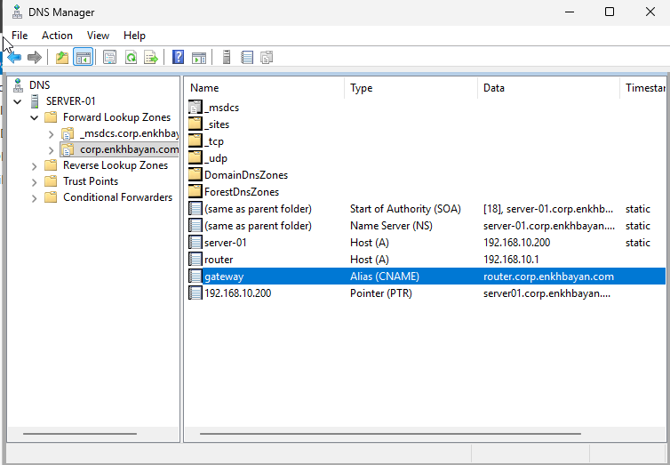
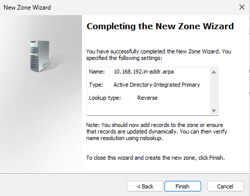

# Lab 04 - DNS Server Configuration

## Overview

This lab covers the installation and configuration of the DNS Server role on Windows Server 2025. DNS is a critical service in Active Directory environments, providing name resolution for domain resources and network services.

---

## Lab Environment

| Component | Configuration |
|-----------|---------------|
| Hypervisor | Oracle VirtualBox |
| Host Operating System | Windows 10 |
| Guest Operating System | Windows Server 2025 Standard Evaluation |
| Server Name | SERVER-01 |
| Domain | corp.enkhbayan.com |
| Network | Bridged Adapter |

---

## Objectives

- Verify the DNS Server role installation
- Configure Forward Lookup Zones
- Configure Reverse Lookup Zones
- Verify DNS functionality
- Prepare the DNS server for Active Directory services

---

## Tasks Completed

- Verified the DNS Server role
- Opened DNS Manager
- Configured the Forward Lookup Zone
- Created the Reverse Lookup Zone
- Verified DNS zone configuration
- Confirmed DNS integration with Active Directory

---

## DNS Configuration

| Setting | Value |
|---------|-------|
| DNS Zone | corp.enkhbayan.com |
| Zone Type | Active Directory Integrated |
| Dynamic Updates | Secure Only |
| Reverse Lookup Zone | Enabled |

---

## Screenshots

### DNS Manager

### Reverse Lookup Zone

---

## Skills Practiced

- DNS Server Administration
- DNS Manager
- Forward Lookup Zones
- Reverse Lookup Zones
- Active Directory Integrated DNS
- Windows Server Administration

---

## Technologies Used

- Windows Server 2025
- DNS Server
- Active Directory
- Oracle VirtualBox
- Server Manager

---

## Outcome

The DNS Server was successfully configured and integrated with Active Directory. Both Forward Lookup Zones and Reverse Lookup Zones were verified, providing reliable name resolution for the lab environment.

---

## Next Lab

**Lab 05 – DNS Records (A, CNAME and PTR Records)**
