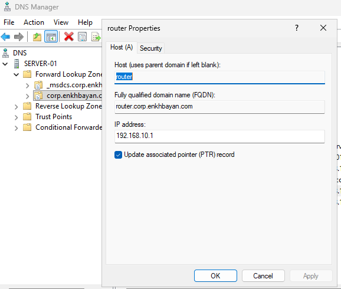
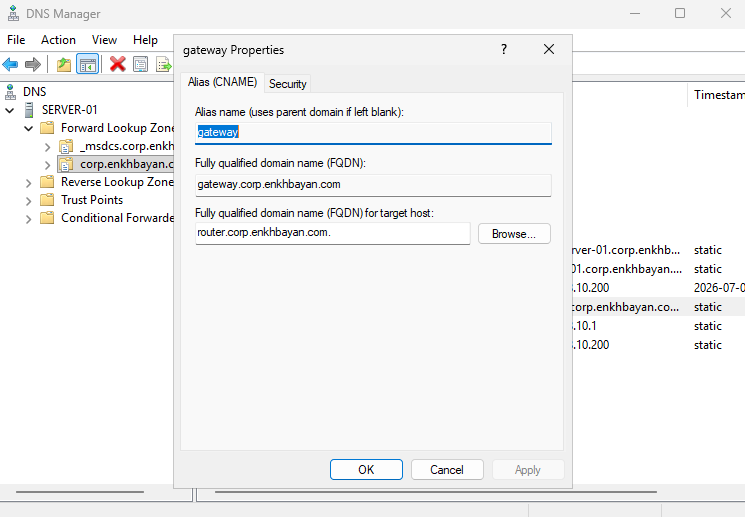
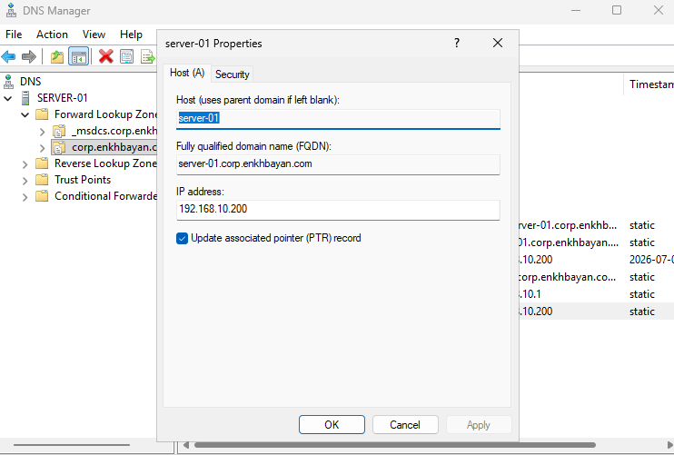

# Lab 05 - DNS Records (A, CNAME and PTR)

## Overview

This lab demonstrates how to create and manage common DNS record types in Windows Server 2025. The configuration includes Host (A), Alias (CNAME), and Pointer (PTR) records to provide both forward and reverse name resolution.

---

## Lab Environment

| Component | Configuration |
|-----------|---------------|
| Hypervisor | Oracle VirtualBox |
| Host Operating System | Windows 10 |
| Guest Operating System | Windows Server 2025 Standard Evaluation |
| Server Name | SERVER-01 |
| Domain | corp.enkhbayan.com |
| DNS Zone | corp.enkhbayan.com |

---

## Objectives

- Create Host (A) records
- Create Alias (CNAME) records
- Create Pointer (PTR) records
- Verify forward name resolution
- Verify reverse name resolution

---

## Tasks Completed

- Created Host (A) records
- Created Alias (CNAME) records
- Created Pointer (PTR) records
- Verified DNS record resolution
- Reviewed DNS record properties

---

## DNS Records

### Host (A) Records

| Hostname | IP Address |
|----------|------------|
| server-01 | 192.168.10.200 |
| router | 192.168.10.1 |

Host (A) records map a hostname to an IPv4 address.

---

### Alias (CNAME) Record

| Alias | Points To |
|-------|-----------|
| gateway | router.corp.enkhbayan.com |

A CNAME record creates an alias for an existing hostname.

---

### Pointer (PTR) Record

| IP Address | Hostname |
|-----------|----------|
| 192.168.10.200 | server-01.corp.enkhbayan.com |

PTR records provide reverse DNS lookups by mapping an IP address back to a hostname.

---

## Screenshots

### A Record

### CNAME Record

### PTR Record

---

## Skills Practiced

- DNS Administration
- DNS Manager
- Host (A) Records
- Alias (CNAME) Records
- Pointer (PTR) Records
- Forward Lookup Zones
- Reverse Lookup Zones
- Name Resolution

---

## Technologies Used

- Windows Server 2025
- DNS Server
- Active Directory
- Oracle VirtualBox
- IPv4 Networking

---

## Outcome

The DNS infrastructure was successfully configured with A, CNAME, and PTR records. Both forward and reverse DNS resolution were verified, providing reliable name resolution for the Active Directory environment.

---

## Key Concepts

- **A Record** → Hostname → IP Address
- **CNAME Record** → Alias → Existing Hostname
- **PTR Record** → IP Address → Hostname

These DNS record types are fundamental components of enterprise Windows Server environments.
