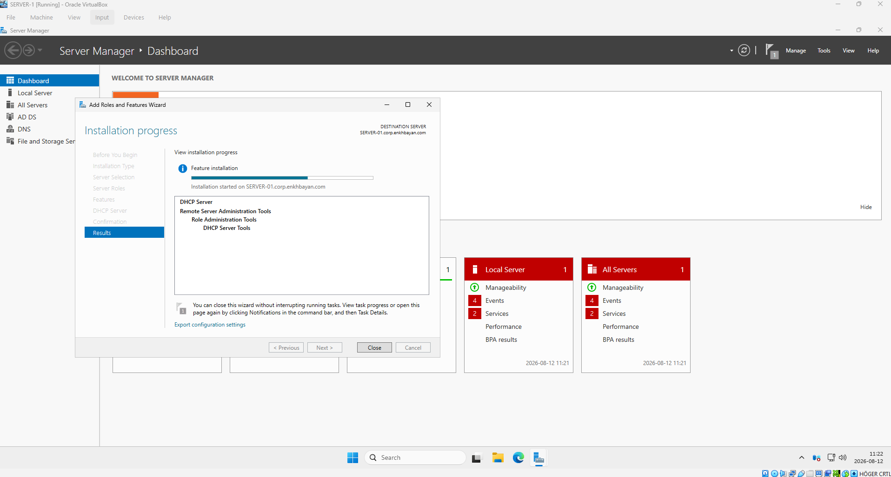
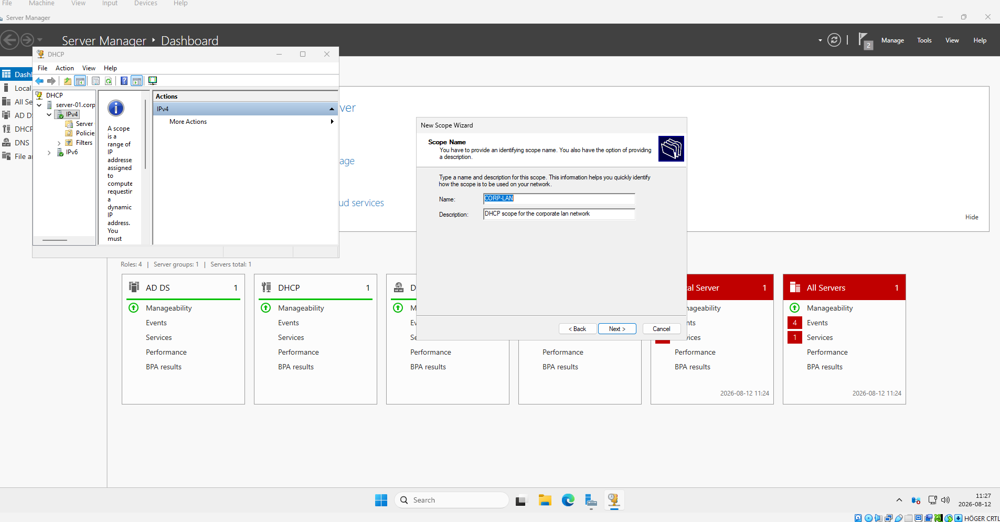
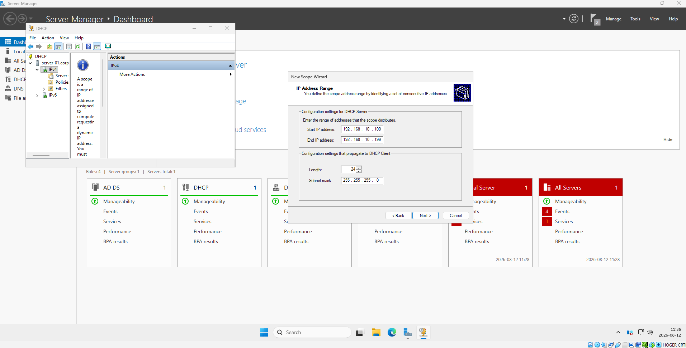
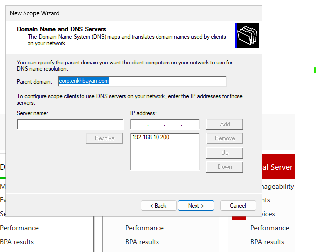

# DHCP Server Configuration — Windows Server

## Overview

This lab demonstrates the installation and configuration of a DHCP (Dynamic Host Configuration Protocol) Server in a Windows Server Active Directory environment.

The DHCP server automatically provides network configuration to clients, including IP addresses, subnet masks, default gateway, DNS server, and DNS domain information.

---

## Lab Environment

| Component       | Configuration                     |
| --------------- | --------------------------------- |
| Server          | SERVER-01                         |
| Domain          | `corp.enkhbayan.com`              |
| Server IP       | `192.168.10.200`                  |
| Subnet          | `192.168.10.0/24`                 |
| Subnet Mask     | `255.255.255.0`                   |
| Default Gateway | `192.168.10.1`                    |
| DNS Server      | `192.168.10.200`                  |
| DHCP Scope      | `CORP-LAN`                        |
| DHCP Pool       | `192.168.10.100 - 192.168.10.199` |

---

## Network Architecture

```text
                    Default Gateway
                     192.168.10.1
                           |
                    192.168.10.0/24
                           |
              +------------+------------+
              |                         |
          SERVER-01                DHCP Clients
        192.168.10.200           192.168.10.100-199
              |
              +-- AD DS
              +-- DNS
              +-- DHCP
```

---

## 1. Install DHCP Server Role

The DHCP Server role was installed using:

**Server Manager → Manage → Add Roles and Features → DHCP Server**

After installation, the DHCP server was authorized in the Active Directory domain.



---

## 2. Create DHCP Scope

A new IPv4 DHCP scope named **CORP-LAN** was created for the local network.



---

## 3. Configure Address Pool

The DHCP address pool was configured as:

* **Start IP:** `192.168.10.100`
* **End IP:** `192.168.10.199`
* **Subnet Mask:** `255.255.255.0`
* **Prefix:** `/24`

SERVER-01 uses the static address `192.168.10.200`, which is outside the DHCP pool.



---

## 4. Configure Lease Duration

The DHCP lease duration determines how long a client can use an assigned IP address before renewing the lease.


---

## 5. Configure Scope Options

The DHCP scope distributes additional network settings to clients.

### Option 003 — Default Gateway

`192.168.10.1`

### Option 006 — DNS Server

`192.168.10.200`

### Option 015 — DNS Domain Name

`corp.enkhbayan.com`



---

## DHCP Configuration Summary

```text
Scope Name:       CORP-LAN
Network:          192.168.10.0/24
Address Pool:     192.168.10.100 - 192.168.10.199
Subnet Mask:      255.255.255.0
Default Gateway:  192.168.10.1
DNS Server:       192.168.10.200
DNS Domain:       corp.enkhbayan.com
```

---

## DHCP DORA Process

DHCP clients obtain an IP address using the DORA process:

1. **Discover** — Client searches for a DHCP server.
2. **Offer** — DHCP server offers an available IP address.
3. **Request** — Client requests the offered IP address.
4. **Acknowledge** — DHCP server confirms the lease.

```text
Client                         DHCP Server
  |                                |
  |------- DHCP Discover --------->|
  |<-------- DHCP Offer -----------|
  |------- DHCP Request ---------->|
  |<--------- DHCP ACK ------------|
```

---

## Client Verification

A DHCP client can request a new IP configuration using:

```powershell
ipconfig /release
ipconfig /renew
```

The complete network configuration can be verified with:

```powershell
ipconfig /all
```

A correctly configured client should receive:

```text
IPv4 Address:     192.168.10.100-199
Subnet Mask:      255.255.255.0
Default Gateway:  192.168.10.1
DHCP Server:      192.168.10.200
DNS Server:       192.168.10.200
DNS Suffix:       corp.enkhbayan.com
```

---

## Troubleshooting

If a client cannot obtain an IP address:

* Verify that the DHCP service is running.
* Verify that the DHCP server is authorized.
* Verify that the DHCP scope is active.
* Check that addresses are available in the DHCP pool.
* Verify that the client is configured to obtain an IP address automatically.
* Check network connectivity between the client and DHCP server.
* Check for conflicting DHCP servers.
* Check firewall and network configuration.

An address in the `169.254.0.0/16` range can indicate that the client was unable to obtain an IPv4 address from DHCP.

---

## Skills Demonstrated

* Windows Server administration
* DHCP Server deployment
* DHCP scope configuration
* IPv4 addressing
* DHCP lease management
* Default gateway configuration
* DNS integration
* Active Directory network services
* Network troubleshooting

---

## Future Improvements

* DHCP reservations
* DHCP exclusions
* DHCP failover
* Dynamic DNS updates
* Multiple DHCP scopes
* VLAN and DHCP relay configuration
* PowerShell DHCP automation
