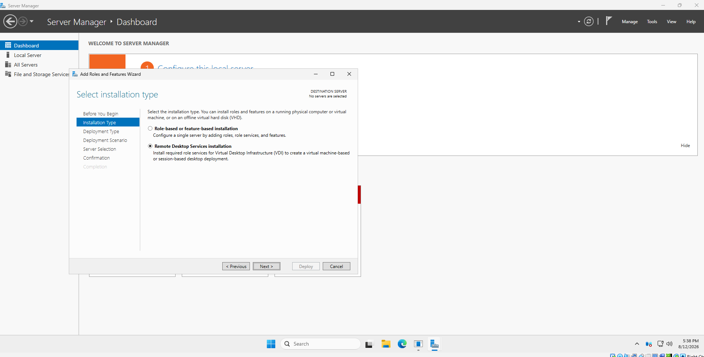
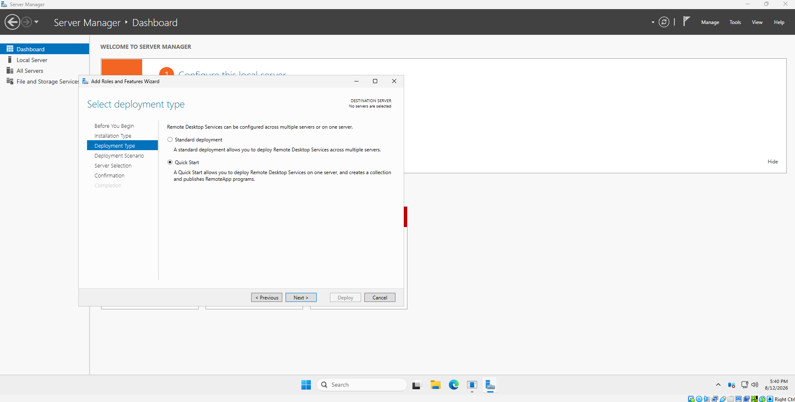
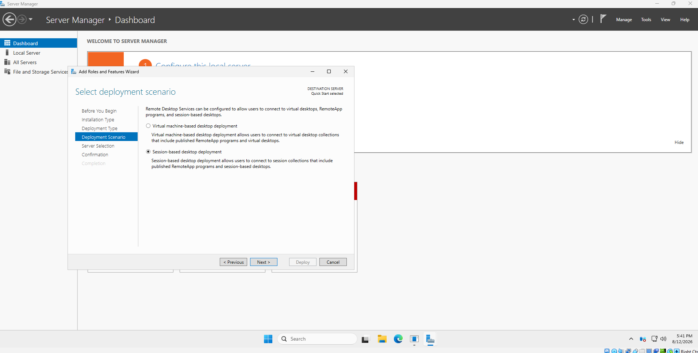
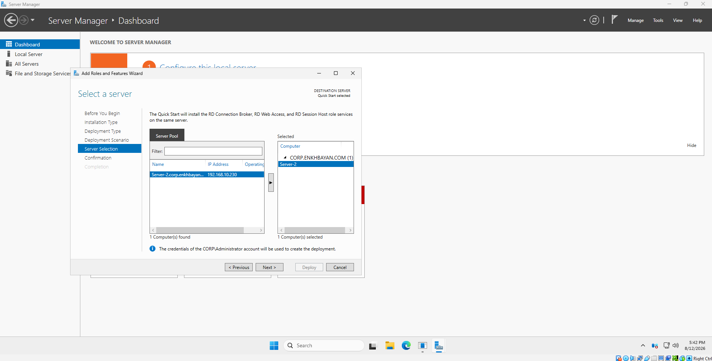
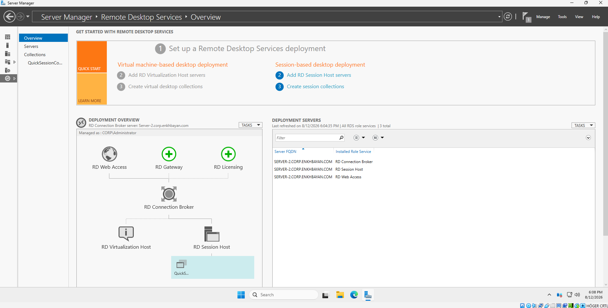
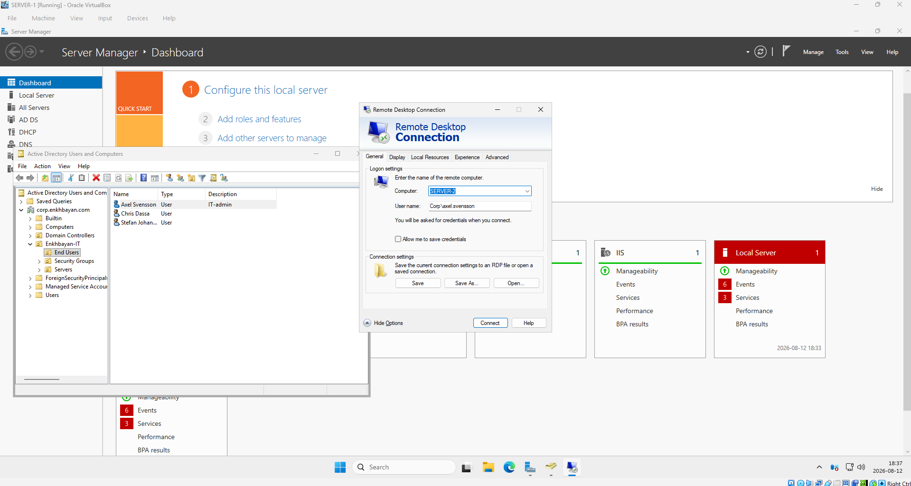
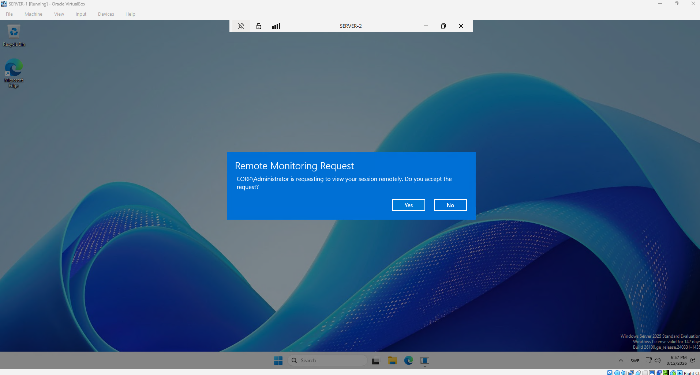

# Remote Desktop Services (RDS) Lab

## Overview

This lab demonstrates the deployment and testing of **Remote Desktop Services (RDS)** in a Windows Server 2025 Active Directory environment.

The goal was to configure a domain-joined member server as an RDS server, allow domain users to establish remote desktop sessions, and test basic RDS administration features such as session monitoring and shadowing.

---

## Lab Environment

| Server               | Role                                        |
| -------------------- | ------------------------------------------- |
| **SERVER-1**         | Active Directory Domain Services, DNS, DHCP |
| **SERVER-2**         | Remote Desktop Services                     |
| **Domain**           | corp.enkhbayan.com                          |
| **Operating System** | Windows Server 2025                         |
| **Virtualization**   | Oracle VirtualBox                           |

### Architecture

```text
                     SERVER-1
              Domain Controller
        ┌─────────────────────────┐
        │ Active Directory (AD DS)│
        │ DNS                     │
        │ DHCP                    │
        └────────────┬────────────┘
                     │
              corp.enkhbayan.com
                     │
                     ▼
                  SERVER-2
        ┌─────────────────────────┐
        │ Remote Desktop Services │
        │                         │
        │ RD Connection Broker    │
        │ RD Web Access           │
        │ RD Session Host         │
        └────────────┬────────────┘
                     │
                     │ RDP
                     ▼
                Domain User
```

---

## 1. RDS Installation Type

Remote Desktop Services was installed using the dedicated **Remote Desktop Services installation** option in Server Manager.



This deployment method provides the components required to build an RDS environment instead of installing individual Windows Server roles manually.

---

## 2. Quick Start Deployment

For this lab, I selected **Quick Start**.



Quick Start is appropriate for a small lab or test environment because the required RDS role services can be deployed on a single server.

In a larger production environment, **Standard Deployment** would normally be considered because RDS roles can be distributed across multiple servers for better scalability and availability.

---

## 3. Session-Based Desktop Deployment

I selected **Session-based desktop deployment**.



This allows multiple users to connect to the same RD Session Host while maintaining separate Windows sessions.

Each user receives an independent session instead of a dedicated virtual machine.

---

## 4. RDS Server Selection

**SERVER-2** was selected as the Remote Desktop Services server.



SERVER-2 is a domain-joined member server, while SERVER-1 continues to provide the core infrastructure services such as Active Directory, DNS, and DHCP.

This keeps the RDS workload separate from the Domain Controller.

---

## 5. RDS Deployment

The RDS deployment completed successfully on SERVER-2.



The Quick Start deployment installed the main RDS components required for the lab, including:

* **RD Connection Broker** – manages RDS connections and sessions.
* **RD Web Access** – provides web-based access to published RDS resources.
* **RD Session Host** – hosts Windows desktop sessions and applications for users.

---

## 6. Remote Desktop Connection

A domain user account was used to test Remote Desktop connectivity to SERVER-2.



Authentication is handled through the Active Directory domain.

The connection uses a domain account in the following format:

```text
CORP\username
```

This demonstrates centralized authentication rather than relying on separate local accounts on the RDS server.

---

## 7. Successful RDP Session

The domain user successfully connected to SERVER-2 through Remote Desktop.


This verified that:

* SERVER-2 was reachable through RDP.
* Domain authentication was working.
* The user was authorized to access the RDS environment.
* An individual remote desktop session could be created successfully.

---

## 8. RDS Session Shadowing

RDS session management and **shadowing** were also tested.



Shadowing allows an administrator or support technician to view or control an active user's Remote Desktop session, depending on the configured permissions.

This can be useful for:

* Remote troubleshooting
* User support
* Application troubleshooting
* Demonstrating procedures to users

Conceptually:

```text
User
  │
  │ RDP
  ▼
SERVER-2
  │
  │ Active User Session
  │
  └──── Admin → Shadow Session
```

---

## RDP vs RDS

**RDP (Remote Desktop Protocol)** is the protocol used to establish a remote graphical connection.

**RDS (Remote Desktop Services)** is the Windows Server platform used to provide and centrally manage remote desktop sessions and applications for multiple users.

```text
RDP = Remote connection protocol

RDS = Remote desktop infrastructure and services
```

---

## Quick Start vs Standard Deployment

| Quick Start                     | Standard Deployment                     |
| ------------------------------- | --------------------------------------- |
| Designed for simple deployments | Designed for larger deployments         |
| Suitable for labs and testing   | Suitable for production environments    |
| RDS roles can run on one server | Roles can be distributed across servers |
| Fast configuration              | More configuration flexibility          |
| Limited scalability             | Better scalability and availability     |

---

## Skills Practiced

* Windows Server 2025 administration
* Remote Desktop Services deployment
* Active Directory integration
* Domain user authentication
* RDP connectivity
* RD Session Host
* RD Connection Broker
* RD Web Access
* RDS collections
* Remote session administration
* Session shadowing
* Basic RDS troubleshooting

---

## Key Takeaways

This lab demonstrated how Remote Desktop Services can provide centralized Windows desktop sessions to domain users.

It also demonstrated the relationship between **Active Directory and RDS**, where SERVER-1 provides identity and core network services while SERVER-2 provides remote desktop sessions.

For a production RDS environment, additional areas such as **RD Gateway, RDS licensing, TLS certificates, security policies, profile management, high availability, and multiple Session Hosts** would need to be considered.
