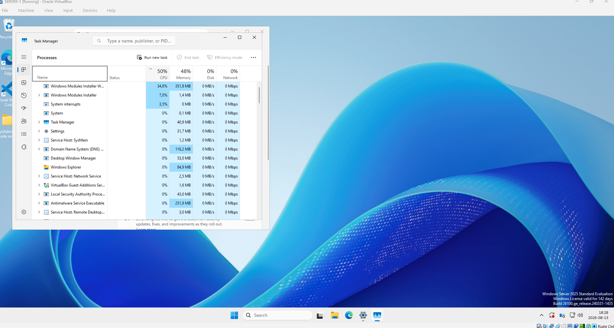
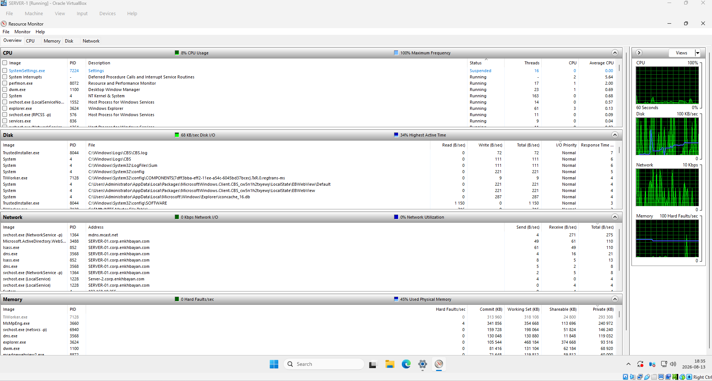
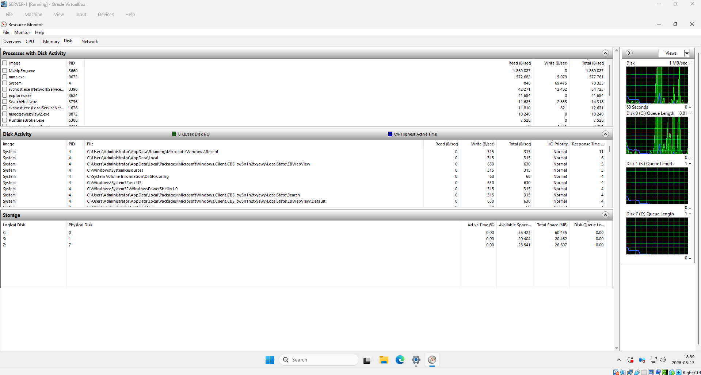
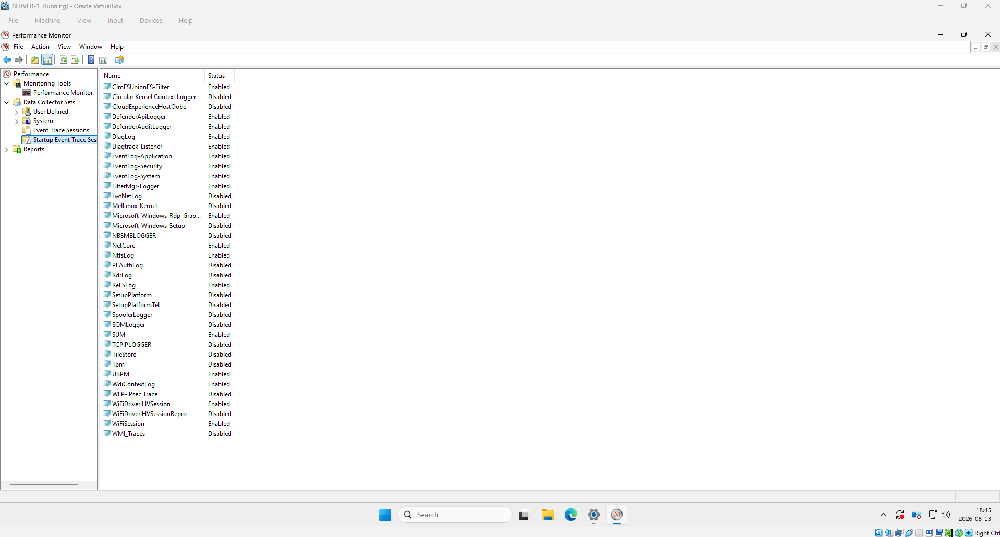

# Windows Server Monitoring and Troubleshooting

## Objective

Monitor Windows Server 2025 performance and troubleshoot
resource-related issues using built-in Windows administration tools.

## Environment

- Windows Server 2025
- Oracle VirtualBox
- Active Directory domain environment

## Tools Used

- Task Manager
- Resource Monitor
- Performance Monitor

## 1. Task Manager

Used Task Manager to monitor real-time server resource utilization.

Monitored:
- CPU usage
- Memory usage
- Disk activity
- Network activity
- Running processes

## 2. Resource Monitor

Used Resource Monitor for more detailed analysis of system resources.

Investigated:
- CPU activity by process
- Memory utilization
- Disk read/write activity
- Disk response time
- Network activity

## 3. Disk Monitoring

Used Resource Monitor to inspect disk I/O activity and identify
processes generating disk operations.

## 4. Performance Monitor

Explored Windows Performance Monitor (PerfMon) for advanced
performance monitoring and long-term data collection.

PerfMon can be used to monitor counters such as:

- Processor utilization
- Available memory
- Disk performance
- Network throughput

## Troubleshooting Workflow

When investigating a slow Windows Server:

1. Check Task Manager for overall resource utilization.
2. Use Resource Monitor to identify the responsible process.
3. Check disk, memory, CPU, and network activity.
4. Use Performance Monitor for detailed or long-term monitoring.
5. Correlate performance problems with Windows Event Viewer logs.

## Skills Demonstrated

- Windows Server performance monitoring
- CPU and memory analysis
- Disk I/O troubleshooting
- Process-level resource analysis
- Performance Monitor fundamentals
- Windows Server troubleshooting
