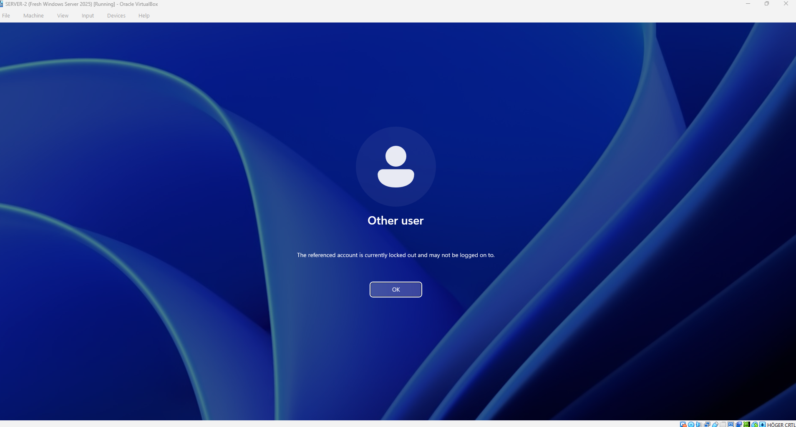
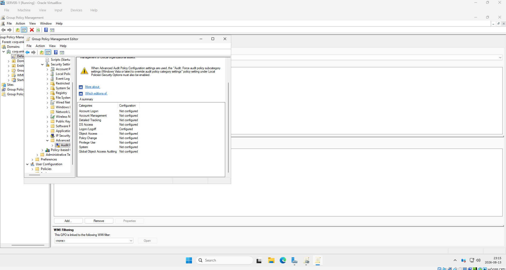
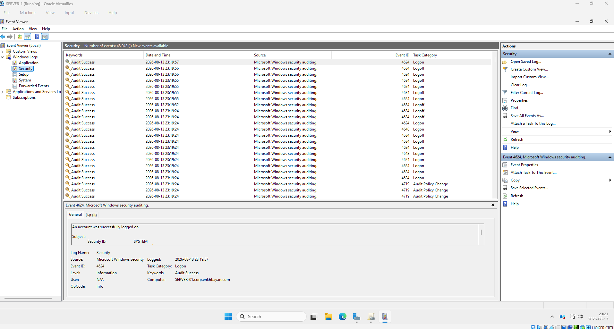
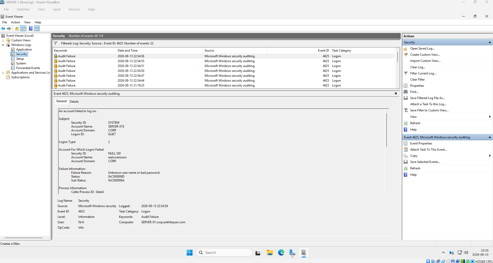
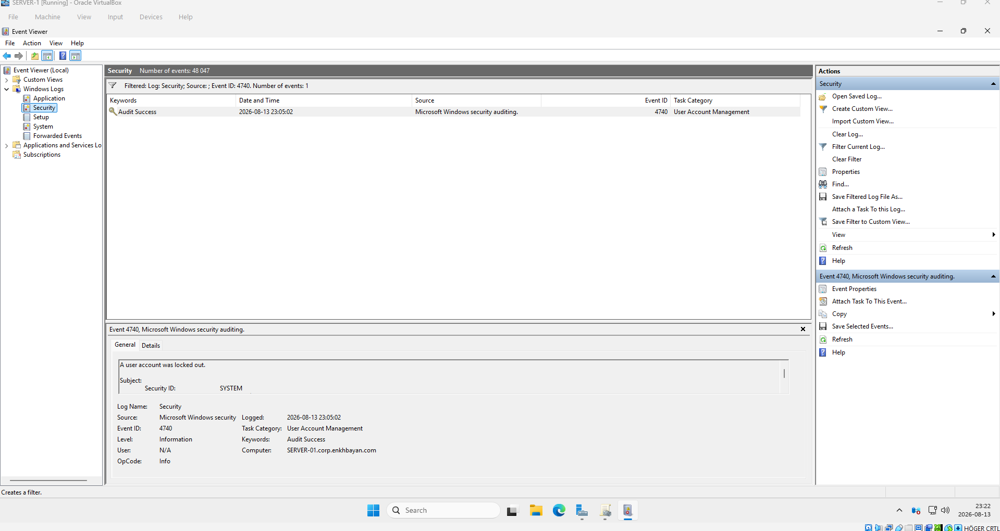
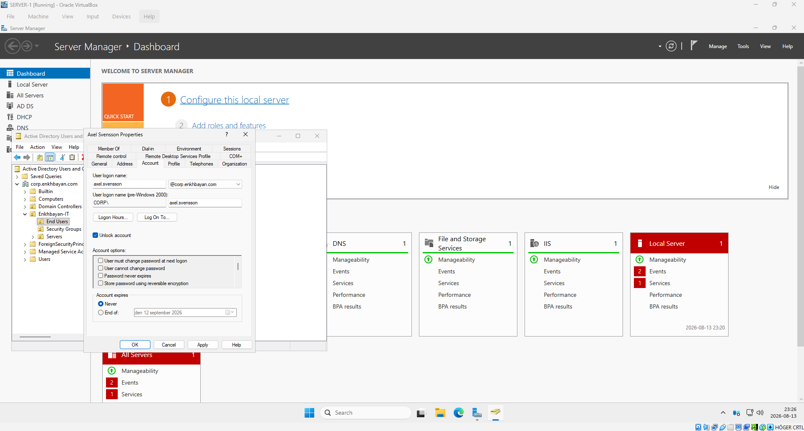

# Troubleshooting Active Directory Account Lockouts

## Overview

This lab demonstrates how to troubleshoot repeated user account lockouts in a Windows Server 2025 Active Directory environment.

The goal was to identify failed logon attempts using Group Policy auditing and Windows Event Viewer, determine when an account was locked, and restore access to the user account.

## Lab Environment

- Windows Server 2025
- Active Directory Domain Services (AD DS)
- Group Policy Management
- Windows Event Viewer
- Active Directory Users and Computers
- Oracle VirtualBox

## Scenario

A domain user was unable to sign in because the account had been locked after multiple failed password attempts.

Instead of only unlocking the account, the objective was to investigate the authentication events and understand how a system administrator can identify the cause of repeated account lockouts.

## 1. Account Locked Out

Multiple incorrect password attempts caused the domain user account to become locked.



Account lockouts can be caused by:

- Repeated incorrect passwords
- Cached credentials
- Mapped network drives using old credentials
- Scheduled tasks
- Windows services
- VPN or RDP connections
- Mobile devices using an old password
- Brute-force authentication attempts

## 2. Configure Logon Auditing

Group Policy was configured to audit successful and failed logon events.

Path:

```text
Computer Configuration
→ Policies
→ Windows Settings
→ Security Settings
→ Advanced Audit Policy Configuration
→ Audit Policies
→ Logon/Logoff
```



This allows authentication activity to be recorded in the Windows Security event log.

## 3. Investigate Security Logs

Windows Event Viewer was used to investigate authentication events.

Path:

```text
Event Viewer
→ Windows Logs
→ Security
```



Filtering the Security log makes it easier to isolate specific authentication events.

## 4. Event ID 4625 — Failed Logon

The Security log was filtered for:

```text
Event ID: 4625
```

Event ID **4625** indicates that an account failed to log on.



This event can help administrators investigate failed authentication attempts and determine where incorrect credentials may be coming from.

## 5. Event ID 4740 — Account Lockout

The Security log was then filtered for:

```text
Event ID: 4740
```

Event ID **4740** indicates that a user account was locked out.



By correlating Event ID 4740 with failed logon events such as Event ID 4625, an administrator can investigate the source and timing of an account lockout.

## 6. Unlock the User Account

After the investigation, the affected account was unlocked using Active Directory Users and Computers.



In a production environment, repeatedly unlocking an account without investigating the cause would not be sufficient. The underlying source of the failed authentication attempts should also be identified and corrected.

## Important Event IDs

| Event ID | Description |
|----------|-------------|
| 4624 | Successful logon |
| 4625 | Failed logon |
| 4740 | User account locked out |

## Troubleshooting Workflow

```text
User reports account lockout
        ↓
Confirm the account is locked
        ↓
Check Event Viewer → Security
        ↓
Find Event ID 4740
        ↓
Check failed logons (Event ID 4625)
        ↓
Identify the source of authentication failures
        ↓
Correct the root cause
        ↓
Unlock the account
        ↓
Verify successful authentication
```

## Skills Practiced

- Active Directory account administration
- Group Policy configuration
- Windows security auditing
- Event Viewer troubleshooting
- Authentication log analysis
- Account lockout investigation
- Windows Server troubleshooting

## Key Takeaway

An account lockout should not always be treated as a simple account-unlock request.

If the problem repeatedly occurs, a system administrator should investigate the authentication logs, correlate failed logon events with the account lockout event, identify the source of the incorrect credentials, and resolve the root cause.

This lab demonstrates a basic real-world Windows Server troubleshooting workflow.
