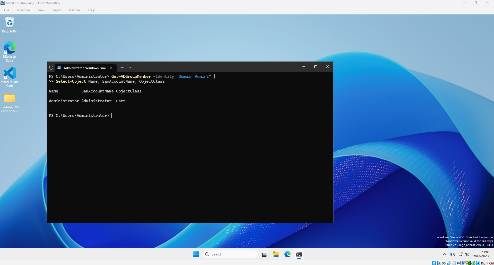
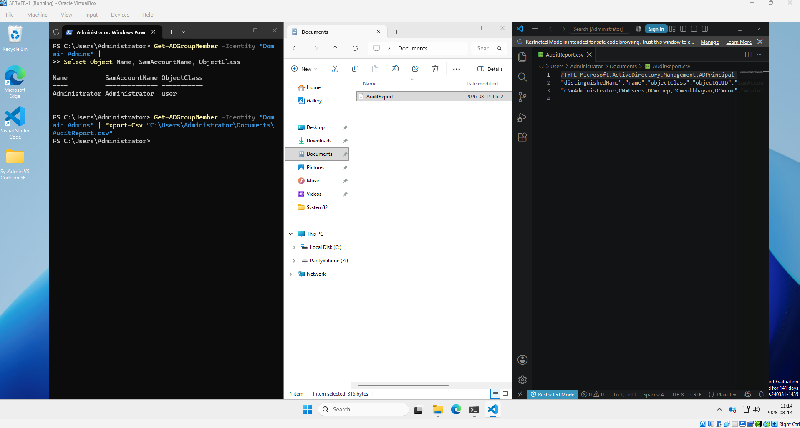
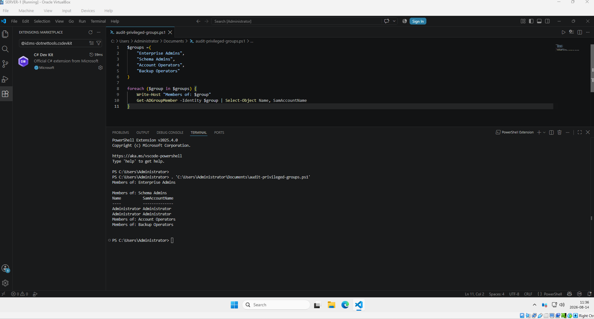

# Privileged Access Audit with PowerShell

## Overview

This lab demonstrates how to audit privileged accounts and high-risk Active Directory groups using PowerShell in a Windows Server 2025 environment.

The objective is to identify users with elevated privileges, review membership of sensitive Active Directory groups, and generate audit information that can be used for security reviews and access management.

## Lab Environment

- Windows Server 2025
- Active Directory Domain Services (AD DS)
- Active Directory PowerShell Module
- PowerShell
- Active Directory Users and Computers

## Scenario

Privileged accounts have elevated permissions and can make significant changes to an Active Directory environment.

As a system administrator, it is important to regularly review privileged group memberships and verify that only authorized users retain elevated access.

This lab audits the Domain Admins group and several other privileged Active Directory groups using PowerShell.

---

## 1. Audit Domain Admins

The following PowerShell command was used to identify members of the Domain Admins group:

```powershell
Get-ADGroupMember -Identity "Domain Admins" |
    Select-Object Name, SamAccountName
```

This provides a quick way to identify accounts with Domain Administrator privileges.



### Why This Matters

Domain Admin accounts have extensive privileges across the Active Directory domain.

Unnecessary membership in this group increases the potential impact of:

- Compromised credentials
- Privilege abuse
- Configuration mistakes
- Malware or ransomware
- Unauthorized administrative changes

Privileged access should therefore follow the **Principle of Least Privilege**.

---

## 2. Create an Audit Report

PowerShell can also export group membership information to a CSV file for documentation and security reviews.

Example:

```powershell
Get-ADGroupMember -Identity "Domain Admins" |
    Select-Object Name, SamAccountName |
    Export-Csv "C:\Audit\domain-admins-audit.csv" -NoTypeInformation
```



CSV reports can be useful for:

- Periodic access reviews
- Security audits
- Compliance documentation
- Management review
- Identifying unauthorized privileged accounts

---

## 3. Audit Multiple Privileged Groups

Checking privileged groups manually one at a time becomes inefficient as an environment grows.

A PowerShell script was therefore created to audit multiple high-privilege Active Directory groups automatically.

Groups audited in this lab:

- Enterprise Admins
- Schema Admins
- Account Operators
- Backup Operators



The script is available here:

`audit-privileged-groups.ps1`

### PowerShell Script

```powershell
$groups = (
    "Enterprise Admins",
    "Schema Admins",
    "Account Operators",
    "Backup Operators"
)

foreach ($group in $groups) {

    Write-Host "Members of: $group"

    Get-ADGroupMember -Identity $group |
        Select-Object Name, SamAccountName
}
```

---

## How the Script Works

The `$groups` variable contains the Active Directory groups that need to be audited.

The `foreach` loop processes each group individually:

```text
Privileged Groups
       |
       v
foreach loop
       |
       v
Get-ADGroupMember
       |
       v
Retrieve group members
       |
       v
Select Name + SamAccountName
       |
       v
Display audit results
```

This reduces repetitive administrative work and provides a consistent method for checking privileged access.

---

## Security Principle: Least Privilege

The Principle of Least Privilege means that users should only receive the permissions required to perform their job.

For example:

```text
User
 |
 v
Does the user require Domain Admin privileges?
 |
 +---- YES ---> Keep access and document the reason
 |
 +---- NO ----> Remove unnecessary privileges
```

Privileged group membership should be reviewed regularly rather than allowing administrative access to remain indefinitely.

---

## Privileged Groups Reviewed

| Group | Purpose |
|---|---|
| Domain Admins | Administrative control across the domain |
| Enterprise Admins | High-level administrative privileges across an AD forest |
| Schema Admins | Permission to modify the Active Directory schema |
| Account Operators | Limited account and group administration capabilities |
| Backup Operators | Backup and restore privileges on systems |

---

## Audit Workflow

```text
Identify privileged groups
        ↓
Query group membership
        ↓
Review users and accounts
        ↓
Determine whether access is required
        ↓
Remove unnecessary privileges
        ↓
Document the results
        ↓
Repeat the audit periodically
```

---

## Skills Practiced

- Active Directory administration
- Privileged access management
- PowerShell administration
- `Get-ADGroupMember`
- `Select-Object`
- PowerShell variables
- PowerShell arrays
- `foreach` loops
- PowerShell pipelines
- CSV report generation
- Principle of Least Privilege
- Security auditing

---

## Key Takeaway

Privileged access should not be granted permanently without review.

System administrators should regularly audit sensitive Active Directory groups, identify unnecessary elevated permissions, remove unauthorized access, and maintain records of privileged accounts.

PowerShell makes this process faster, repeatable, and easier to scale than manually checking each group through the Active Directory GUI.
